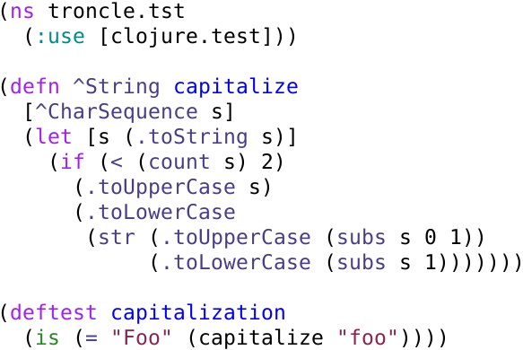
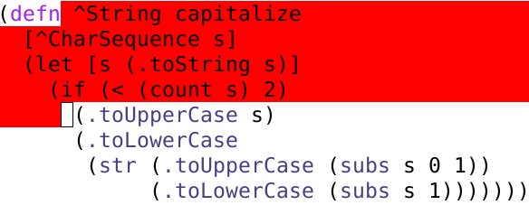
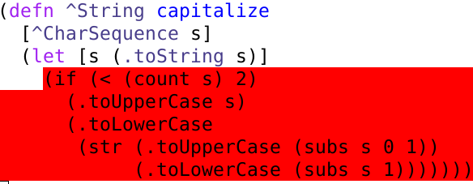

# troncle

Troncle is a proof-of-concept integration of clojure's tracing tools
with emacs, inspired by technomancy's innovative
[nrepl-discover](https://github.com/technomancy/nrepl-discover) and a
robust (very simple) [code-walking/wrapping
macro](https://github.com/coventry/troncle/blob/master/src/troncle/macroshka.clj)
I've developed.

`clojure.tools.trace` is super-handy for exploring how code is
executing, but wrapping and unwrapping subforms with `(ctt/trace ...)`
gets tedious.  The main idea with troncle is to take most of that tedium
away by letting you use emacs to point at the forms you want to wrap and
then doing the wrapping for you automatically during compilation.

If this seems like an interesting project to you, please take a look at
the [roadmap](#roadmap) and let me know what you think.  If it seems
useless or otherwise misguided, please also let me know what you
think. :-) All feedback is welcome.

## Usage

### Basic tracing

Troncle's goal is to speed up a typical repl debugging workflow.
When you hit a bug, you write a test for it.  For instance, suppose we
have the following simple clojure file.



If we compile this and run the test, it fails:

```clojure
troncle.tst> (capitalization)

FAIL in (capitalization) (tst.clj:14)
expected: (= "Foo" (capitalize "foo"))
  actual: (not (= "Foo" "foo"))
```

You can use troncle to quickly select regions of the code and check what
values they're returning as you're running the test.  In this case,
you'd do `C-c t E` (`troncle-set-exec-var`), choose `capitalization`,
then choose a region of the `capitalize` form to instrument for tracing
and send it off with `C-c t R` (`troncle-trace-region`.)  By the way,
the var you choose with `troncle-set-exec-var` needn't be in the same
namespace as the code you're interested in tracing (pop up to the
namespace-level by selecting ".." in the minibuffer), so it is
compatible with the usual practice of separating code and tests.  You
can also set the function to be executed at the repl by passing the
function `t/st` a function which takes no arguments (E.g., `(t/st
troncle.tst/capitalization)`.  Whichever method you use, the function
will be called with no arguments on the clojure side when
`troncle-trace-region` is called on the emacs side.

Suppose we run `C-c t R` with the following region of `tst.clj`
selected:



This results in the following output in the repl:

```clojure
L:5 C:11 (.toString s)
=> "foo"
L:6 C:12 (count s)
=> 3
L:6 C:9 (< (count s) 2)
=> false
```

Troncle wraps all evaluable forms in the full macroexpansion of any
forms in the region with tracing instrumentation.  In this case, for
instance, `L:5 C:11 (.toString s) => "foo"` means that the form
`(.toString s)` starting at line 5, column 11 returned the value "foo".

It all looks like sensible output, so let's try selecting another
region:



Part of the output from this is 

```clojure
L:9 C:8 (str (.toUpperCase (subs s 0 1)) (.toLowerCase (subs s 1)))
=> "Foo"
L:8 C:7 (.toLowerCase (str (.toUpperCase (subs s 0 1)) (.toLowerCase (subs s 1))))
=> "foo"
```

So we've found the bug, a spurious `(.toLowerCase)`.

### Hooking in to the traces

Sometimes, you don't want every iteration to be traced, or want some
extra behavior to take place.  You can do that at the repl by passing
custom functions which take one argument to the following functions:

1. `t/sc`: Pass this a predicate to specify whether or not to log the
   current evaluation of the form.

2. `t/sh`: Pass this a function which you want to run every time the
   tracing instrumentation is exercised.

3. `t/sr`: Pass this a function which will report the trace.

When called, the functions you specify this way will be passed a single
map with keys `:line`, `:column`, `:form` (form under consideration and
its source code position) and `:value` (the value returned from
evaluating the form.)

(`t/` is just a convenience namespace.  The canonical location for these
functions is [`troncle.traces`](src/troncle/traces.clj).)

### Tracing a var

This is taken from technomancy's `nrepl-discover`.  The key sequence
`C-c t V` will ask you for a var to trace.  This will be traced in the
same way as it would be by `clojure.tools.trace/trace-vars`.  For
instance if you go back to `tst.clj`, type `C-c t V` and choose
`capitalize`, hit `C-SPC` to specify an empty region, then `C-c t R` to
run the test, you'll see something like the following output in the repl
buffer:

```clojure
TRACE t3710: (troncle.tst/capitalize "foo")
TRACE t3710: => "foo"
```

`C-c t V` again to turn the trace off, and this time `C-c t R` doesn't
produce that tracing output.

There is a hook to control var tracing, too: `t/sa`.  Pass this a
predicate for whether to output a trace on any given call to the traced
var.  It takes one argument: a list of the arguments passed in the
call.  E.g., `

## Installation

1. In emacs, `M-x package-install troncle`.  If you haven't already done
   so, you will first need to add the marmalade repository by putting
   the following in your `~/.emacs` file and executing it, then
   installing the `clojure-mode` and `nrepl` packages with `M-x
   package-install`.

   ```lisp
   (require 'package)
   (add-to-list 'package-archives
                 '("marmalade" . "http://marmalade-repo.org/packages/"))
   ```

2. In the `project.clj` file for the lein project where you want to use
   troncle, add `[troncle "0.1.1-SNAPSHOT"]` to your `:dependencies`
   vector, and

   ```clojure
   :repl-options {:nrepl-middleware [troncle.discover/wrap-discover]}
   ```

   Also add
   
  You can also add these modifications to your `:user` map in your
  `~/.lein/profiles.clj`.

3. `M-x nrepl-jack-in` in your target project.  (Restart the jvm if
   necessary, to get the `troncle.discover` `nrepl` middleware
   operating.)

4. Compile the code you want to execute with `C-c C-k`.

5. Set the function to be run by troncle using `M-x
   troncle-set-exec-var` from emacs or `troncle.traces/st` in the
   `nrepl` buffer.  (see [Usage](usage) for an example.)

6. Mark the forms you want traced, and hit `C-c t R` and watch the
   output in the repl!

## Roadmap


### Extended functionality

This is a very simple application at the moment, but I think it has a
lot of potential.  The core functionality is in `troncle.macroshka`,
which is a very robust code-walking scheme.  (I've run it over the
entire clojure source code.)

These are the directions I'd like to move it in:

1. Emacs convenience functions for passing "load this file" and "run
   this test" functions to `troncle.traces/st`.

2. Tracing instrumentation for multiple regions within a top-level
   form. 

3. Filtered tracing: Only report a trace when a given predicate returns
   true.  Predicate can be specified in terms of return values of the
   forms under consideration.

4. Save and restore current tracing configuration.

5. Tracing of bindings to local variables.

6. Send trace reports to a clojure list, rather than/as well as the
   repl, so that they can be queried programmatically.

7. Replay a series of trace reports using emacs overlays
   (nrepl-discover's overlay facility should make this easy.)

8. Replace the tracing with source-level step debugging.

## License

Copyright © 2013 Alex Coventry

Distributed under the Eclipse Public License either version 1.0 or (at
your option) any later version.
